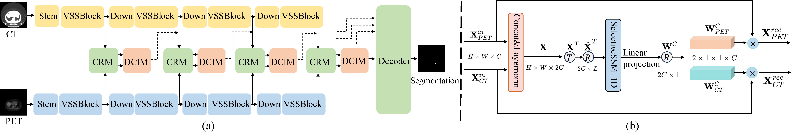

<div align="center">
<h1> Multi-Modal Interactive Perception Network with Mamba for Lung Tumor Segmentation in PET-CT Images </h1>

[Jie Mei](https://jiemei.xyz/)<sup>1</sup>, Chenyu Lin<sup>2</sup>, Yu Qiu<sup>3</sup>, Yaonan Wang<sup>1</sup>, Hui Zhang<sup>1</sup>, Ziyang Wang<sup>4</sup>, Dong Dai<sup>4</sup></sup>

<sup>1</sup>  Hunan University,
<sup>2</sup>  Nankai University,
<sup>3</sup>  Hunan Normal University,
<sup>4</sup>  Tianjin Medical University Cancer Institute and Hospital

[](https://arxiv.org/abs/2503.17261) [](https://opensource.org/licenses/MIT)

</div>

- This repository contains the official code for paper [Multi-Modal Interactive Perception Network with Mamba for Lung Tumor Segmentation in PET-CT Images](https://arxiv.org/abs/2503.17261).
- This paper has been accepted to CVPR 2025.
- This code and PCLT20K dataset are licensed for non-commerical research purpose only.

## Introduction
<p style="text-align:justify; text-justify:inter-ideograph;">
Lung cancer is a leading cause of cancer-related deaths globally. PET-CT is crucial for imaging lung tumors, providing essential metabolic and anatomical information, while it faces challenges such as poor image quality, motion artifacts, and complex tumor morphology. Deep learning-based models are expected to address these problems, however, existing small-scale and private datasets limit significant performance improvements for these methods.
Hence, we introduce a large-scale PET-CT lung tumor segmentation dataset, termed PCLT20K, which comprises 21,930 pairs of PET-CT images from 605 patients.
Furthermore, we propose a cross-modal interactive perception network with Mamba (CIPA) for lung tumor segmentation in PET-CT images. Specifically, we design a channel-wise rectification module (CRM) that implements a channel state space block across multi-modal features to learn correlated representations and helps filter out modality-specific noise. A dynamic cross-modality interaction module (DCIM) is designed to effectively integrate position and context information, which employs PET images to learn regional position information and serves as a bridge to assist in modeling the relationships between local features of CT images. Extensive experiments on a comprehensive benchmark demonstrate the effectiveness of our CIPA compared to the current state-of-the-art segmentation methods. We hope our research can provide more exploration opportunities for medical image segmentation.
</p>



## Environment

1. Create environment.
    ```shell
    conda create -n MIPA python=3.10
    conda activate MIPA
    ```

2. Install all dependencies.
Install pytorch, cuda and cudnn, then install other dependencies via:
    ```shell
    pip install torch==2.1.2 torchvision==0.16.2 torchaudio==2.1.2 --index-url https://download.pytorch.org/whl/cu118
   ```
    ```shell
    pip install -r requirements.txt
    ```

3. Install selective_scan_cuda_core.
    ```shell
    cd models/encoders/selective_scan
    pip install .
    cd ../../..
    ```

## PCLT20K

Please contact Jie Mei (jiemei AT hnu.edu.cn) for the dataset. We will get back to you shortly. The email should contain the following information.
Note: For better academic communication, a real-name system is encouraged and your email suffix must match your affiliation (e.g., hello@hnu.edu.cn). If not, you need to explain why.

```shell
Name: (Tell us who you are.)
Affiliation: (The name/url of your institution or university, etc.)
Job Title: (E.g., Professor, Associate Professor, PhD, etc.)
Email: (Dataset will be sent to this email.)
How to use: (Only for non-commercial use.)
```

## Data Preparation

1. For our dataset PCLT20K, we orgnize the dataset folder in the following structure:
    ```shell
    <PCLT20K>
        |-- <0001>
            |-- <name1_CT.png>
            |-- <name1_PET.png>
            |-- <name1_mask.png>
            ...
        |-- <0002>
            |-- <name2_CT.png>
            |-- <name2_PET.png>
            |-- <name2_mask.png>
            ...
        ...
        |-- train.txt
        |-- test.txt
    ```

    `train.txt/test.txt` contains the names of items in training/testing set, e.g.:

    ```shell
    <name1>
    <name2>
    ...
    ```
2. Please put our dataset in the `data` directory

## Usage

### Training
1. Please download the pretrained [VMamba](https://github.com/MzeroMiko/VMamba) weights, and put them under `pretrained/vmamba/`. We use VMamba_Tiny as default.

    - [VMamba_Tiny](https://drive.google.com/file/d/1W0EFQHvX4Cl6krsAwzlR-VKqQxfWEdM8/view?usp=drive_link)
    - [VMamba_Small](https://drive.google.com/file/d/1671QXJ-faiNX4cYUlXxf8kCpAjeA4Oah/view?usp=drive_link)
    - [VMamba_Base](https://drive.google.com/file/d/1qdH-CQxyUFLq6hElxCANz19IoS-_Cm1L/view?usp=drive_link)


2. Config setting.

    Edit config in the `train.py`.
    Change C.backbone to `sigma_tiny` / `sigma_small` / `sigma_base` to use the three versions of VMamba.

3. Run multi-GPU distributed training:

    ```shell
    torchrun --nproc_per_node 'GPU_Numbers' train.py
    ```

4. You can also use single-GPU training:

    ```shell
    python train.py
    ```
5. Results will be saved in `save_model` folder.

### Testing

The pretrained model of CIPA (CIPA.pth) can be downloaded:

- [Baidu Yunpan](https://pan.baidu.com/s/14MfEaSvc-4QFOIWR7w93Tw), Password: CIPA
- [Google Drive](https://drive.google.com/file/d/1x525pjCi4RM51Kv_zbuW7OLx7NPBLRa8/view?usp=sharing)

```shell
python pred.py
```


## Citation

If you are using the code/model provided here in a publication, please consider citing:

```shell
@inproceedings{mei2025cross,
  title={Cross-Modal Interactive Perception Network with Mamba for Lung Tumor Segmentation in PET-CT Images},
  author={Mei, Jie and Lin, Chenyu and Qiu, Yu and Wang, Yaonan and Zhang, Hui and Wang, Ziyang and Dai, Dong},
  booktitle={IEEE/CVF Conference on Computer Vision and Pattern Recognition},
  year={2025}
}
```

## Contact

For any questions, please contact me via e-mail: jiemei AT hnu.edu.cn.

## Acknowledgment

This project is based on the [VMamba](https://github.com/MzeroMiko/VMamba) and [Sigma](https://github.com/zifuwan/Sigma), thanks for their excellent works.

